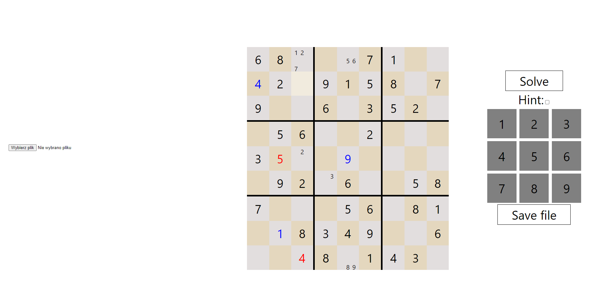

# React Sudoku
Web version of Sudoku game made with React.js which enables user to load numbers from text or json files onto the board as well as save progress to them. It also uses a sudoku-solver package to automatically detect and show completed puzzle.
